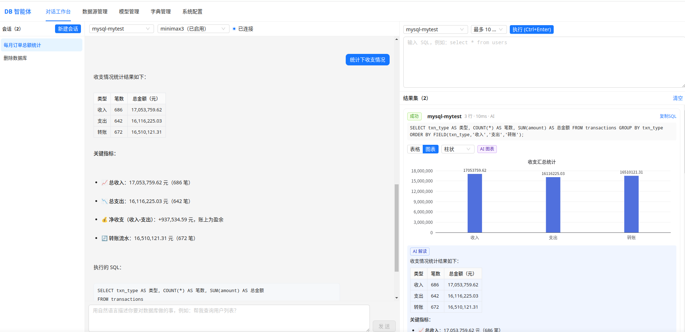

# Database Operation & Analysis Agent

> - Chat in natural language and know your database data inside out. Runs as a single self-contained jar with no other dependencies — use it standalone, or integrate it into your app via the MCP server interface.
> - Core value: data security!!! **Your data and account credentials never leave your domain at any point**, and not a single byte of database data is ever sent to the LLM!!! [This is the essential difference between MyDBAgent and handing your database connection straight to an LLM.]
> - The agent currently only operates on databases; for any instruction or question other than database DDL / DML, it clearly tells you that this type of operation is not supported.
> - **If this project helps you, please consider giving it a ⭐ Star on [Gitee](https://gitee.com/mingzy/database-operation-agent) — your support means a lot and helps others discover it!**

An AI agent that queries and mutates databases through natural-language conversation. Built with Spring Boot + Spring AI: a shared tool layer serves both the built-in chat (Function Calling) and external MCP clients (Streamable HTTP), paired with a Vue3 chat workbench.
- Live demo: https://mydbagent.z-mq.com

## Features

- **Chat workbench (3-pane)**: light top navigation; left pane session list (create / switch / delete), center pane chat (answers and AI commentary rendered as Markdown), right pane SQL console + result set
- **Natural language queries**: the agent inspects schemas, generates & runs SQL, and presents result cards with AI commentary
- **Datasource management**: MySQL / PostgreSQL CRUD, connection test, read-only switch; passwords encrypted with AES-GCM; dynamic Hikari connection pools
- **Model management**: provider / model-ID cascading dropdowns driven by dictionaries, base_url / api_key / parameter configuration, enable switch
- **Sessions & confirmation**: WebSocket real-time message stream; write operations (INSERT/UPDATE/DDL) pop up a confirmation card (60s countdown) and run only after user confirmation
- **Multi-user question queue**: simultaneous questions enter a global FIFO queue and are processed with **up to 5-way concurrency** (balancing responsiveness against model RPM pressure); the queue count refreshes live, and the "currently queuing questions" banner with the count shows only when more than 5 are ahead (≤5 waits silently and starts automatically when your turn arrives); model errors / rate limits surface as a "model usage exceeded, service unavailable" prompt
- **Developer-mode delete guard**: DELETE / DROP / TRUNCATE are blocked by default; the blocking dialog guides you to enable it in "System Config"
- **No-datasource closure**: when no datasource exists, asking a question pops up a "new datasource" form; saving it auto-resends your question
- **SQL console**: run ad-hoc SQL directly (no confirmation); results are persisted and join the result panel
- **Charts (ECharts)**: results of statistical SQL (aggregate functions / GROUP BY) are auto-tagged by the backend, so result cards render a chart by default (tagged "statistical chart", switchable bar / line / pie); the agent can also call `render_chart` explicitly to choose the chart type (tagged "AI chart"); multi-column plain queries default to the table view, and any result card can be switched between table and chart
- **MCP server**: `/mcp` (Streamable HTTP) exposes 6 tools for external clients such as Claude Desktop / Cursor
- **Persistence**: sessions / messages / execution results are all stored in SQLite and restored automatically on refresh
- **Browser-fingerprint session isolation**: sessions are isolated by browser fingerprint (features + local random salt); different browsers can't see each other, and the history session list is filtered by fingerprint as well (see "Browser-Fingerprint Session Isolation") -- you can replace this part with username/password login for account-based isolation
- **Credential isolation**: DB accounts / passwords / hosts never enter the LLM context or MCP responses; tool error messages are masked before returning (see "Credential Security")
- **File logging**: output goes to both the console and a rolling file `logs/database-operation-agent.log` (gzip archives)

Screenshot:



## Architecture

```
┌───────────────────────────────────────────────────────────────┐
│  Browser SPA (Vue3 + ant-design-vue)                          │
│  Chat workbench · Datasources · Models · Dicts · System Config│
└──────────────┬──────────────────────────────┬─────────────────┘
               │ REST /api/*                  │ WebSocket /ws/session/{id}
┌──────────────▼──────────────────────────────▼─────────────────┐
│  Spring Boot 3.5 + Spring AI 1.1                              │
│  ┌─────────────┐  ┌────────────────┐  ┌──────────────────┐    │
│  │ REST        │  │ WS             │  │ MCP Server /mcp  │    │
│  │ controllers │  │ orchestration  │  │ (Streamable HTTP)│    │
│  │ (config     │  │ (confirm/push) │  │                  │    │
│  │  CRUD)      │  │                │  │                  │    │
│  └──────┬──────┘  └───────┬────────┘  └────────┬─────────┘    │
│         └─────────────────┴──────────┬─────────┘              │
│                    Tool layer (single shared implementation)  │
│   list_datasources · list_tables · get_table_schema           │
│   execute_query (row limit/timeout) · execute_update          │
│   (confirm + delete guard) · render_chart (aggregate → ECharts)│
└──────────────┬──────────────────────────────┬─────────────────┘
               │                              │
   SQLite (config & session store)   MySQL / PostgreSQL (business DBs, dynamic pools)
```

## Tech Stack

| Layer | Technology | Version |
|---|---|---|
| Runtime | Java | 21 |
| Backend framework | Spring Boot | 3.5.16 |
| AI orchestration | Spring AI (OpenAI-compatible protocol) | 1.1.8 |
| MCP | Spring AI MCP Server (Streamable HTTP) | 1.1.8 |
| Config/session store | SQLite (sqlite-jdbc) | 3.x |
| Connection pool | HikariCP | Spring Boot managed |
| Frontend | Vue 3 + Vue Router + Pinia | 3.5 / 5.3 / 4.0 |
| UI components | ant-design-vue | 4.2.6 |
| Frontend build | Vite | 8.3.0 |
| Charts / Markdown | ECharts / markdown-it | 6.1 / 15 |
| Logging | Logback (console + rolling file) | Spring Boot managed |
| JDBC drivers | mysql-connector-j / postgresql | Spring Boot managed |

## Quick Start

Requires **JDK 21** (both build and runtime; set `JAVA_HOME` explicitly if your default JDK is older).

```bash
# 1) One-command build (auto-downloads node, builds the frontend and packs it into the jar)
export JAVA_HOME=/path/to/jdk-21
./mvnw clean package

# 2) Run (default port 18080; the config DB is created automatically at ./data/agent.db)
java -jar target/database-operation-agent-1.0.0.jar

# 3) Open the chat workbench
# http://localhost:18080  →  auto-redirects to /chat
```

For day-to-day deployment, use `./deploy.sh` directly: it packages, copies the jar to `deploy/`, restarts from that copy and waits for a health check. The app always runs the `deploy/` copy, so later `mvn package` runs can't corrupt the running JVM's class loading (which causes 504s / NoClassDefFoundError).

### Build the All-in-One Jar

`./mvnw clean package` produces a single executable fat jar in one fully automated step:

1. `frontend-maven-plugin` downloads Node v22 into `target/node` (first build) → `npm install` → `vite build` → `frontend/dist`
2. `maven-resources-plugin` wipes and copies `frontend/dist` into `target/classes/static`
3. `spring-boot:repackage` bundles all dependencies and the frontend into `BOOT-INF/`, producing the final fat jar

Artifact: `target/database-operation-agent-1.0.0.jar` (frontend + backend + dependencies + DB schema/seed in one file; creates and seeds the SQLite DB on first start).

```bash
./mvnw clean package          # full build (includes frontend)
./mvnw clean package -Pskip-frontend   # backend-only iteration, reuses existing dist
java -jar target/database-operation-agent-1.0.0.jar   # run directly
```

The frontend targets Chrome 64 / Firefox 60 / Safari 12+ engines (automatic syntax downleveling + core-js polyfills, see the comments in `frontend/vite.config.js`).

Seed data (`src/main/resources/sql/update.sql`) is applied on first start: two test datasources, dictionaries and system config. The repository contains no LLM API keys — add your test models from the "Models" page.

## Configuration (Pages)

- **Datasource management**: add MySQL / PostgreSQL; "Test connection" verifies instantly; "read-only" datasources reject write operations. Passwords are encrypted with AES-GCM before persisting and are never displayed again.
- **Model management**: provider and model ID come from two-level dictionary cascading; fill in base_url and api_key, then enable. Chat uses the enabled model.
- **Dictionary management**: two dictionary types — `model_provider` (providers) and `model_id` (model IDs, with `parent_key` pointing to a provider); extend them as needed.
- **System config**: the `developer_mode` switch — only when **enabled** are DELETE / DROP / TRUNCATE allowed (disabled by default; deletes are blocked with guidance to enable).

## Chat Workbench & Charts

`/chat` is a 3-pane layout: session list on the left, chat in the center (answers and AI commentary rendered as Markdown), SQL console on the upper right and result set below.

- When a question involves statistical analysis / trends / proportions / grouped comparison, the agent automatically calls the `render_chart` tool to generate aggregate SQL, and the result card is shown as a bar / line / pie chart tagged "AI chart".
- Any result card can be switched between "table / chart" views and chart types via the top-right corner.

## Browser-Fingerprint Session Isolation

Session data is invisible across browsers: the same browser (after refresh / restart) keeps a stable fingerprint, while different browsers / headless instances get distinct fingerprints. Session lists, messages, results, the SQL console and write confirmations are all isolated by fingerprint; datasources, models, dictionaries and system config are global and not isolated.

- **Fingerprint generation**: on first visit, a SHA-256 fingerprint is derived from "browser features (UA / language / screen / timezone / CPU cores, etc.) + a 16-byte random salt" and cached in `localStorage['dbagent_fp']`; subsequent visits reuse it directly, and browser upgrades or screen changes don't affect identity.
- **Fingerprint transport**: REST requests uniformly carry the `X-Browser-Fingerprint` header; the WebSocket endpoint is `/ws/session/{id}?fp=<fingerprint>`.
- **Cross-access protection**: accessing a session (messages / results / console / confirmation / WS connection) with another browser's fingerprint is always rejected with "session does not exist or no access".
- **Upgrade compatibility**: pre-upgrade sessions without a fingerprint are no longer shown (data is kept in the DB); to claim them, first run `localStorage.getItem('dbagent_fp')` in the browser console to get the fingerprint, then run against SQLite:

  ```sql
  UPDATE chat_session SET client_fingerprint='<fingerprint>' WHERE client_fingerprint IS NULL;
  ```

- **Verify**: open http://localhost:18080/chat in two different browsers and create a session in each — the lists are invisible to each other; history survives a refresh in the same browser.

## Logging

The app outputs to both the console and a rolling file: `logs/database-operation-agent.log` (relative to the working directory; override with the `LOG_DIR` env var). Daily + 50MB-per-file rotation, gzip archives, kept for 30 days / 1GB total cap; the business packages log at DEBUG by default.

## MCP Integration

Once the service is up, it exposes a Streamable HTTP endpoint: `http://localhost:18080/mcp`, with 6 tools:

| Tool | Description | Parameters |
|---|---|---|
| `list_datasources` | List configured datasources (name / type / read-only). Call this before any SQL to confirm available datasources | none |
| `list_tables` | List all tables & views with comments in a datasource | `datasourceName` |
| `get_table_schema` | Get column structure of a table (name / type / nullable / PK / default / comment) | `datasourceName`, `tableName` |
| `execute_query` | Run a read-only query, max 10 rows by default; aggregate results (count/sum/avg/group by) also auto-render as a chart in the workbench result panel | `datasourceName`, `sql`, `limit` (optional, default 10) |
| `execute_update` | Run write/DDL statements (INSERT/UPDATE/DELETE/CREATE/ALTER, etc.). Delete-like ops (DELETE/DROP/TRUNCATE) require developer mode; external MCP callers must confirm before invoking | `datasourceName`, `sql` |
| `render_chart` | Run an aggregate SQL and render it as an ECharts chart (bar/line/pie) in the workbench result panel | `datasourceName`, `sql` (aggregate), `chartType` (bar/line/pie), `title` / `xField` / `yField` (optional) |

> Credential safety: datasource accounts / passwords / hosts never enter tool params or responses; tool errors are masked before returning.

Example config for MCP clients that support Streamable HTTP:

```json
{
  "mcpServers": {
    "database-operation-agent": {
      "url": "http://localhost:18080/mcp"
    }
  }
}
```

Quick curl self-test (initialize first, grab the `Mcp-Session-Id` response header, send `notifications/initialized`, then `tools/list` / `tools/call`):

```bash
SID=$(curl -s -o /dev/null -w '%header{Mcp-Session-Id}' -X POST http://localhost:18080/mcp \
  -H 'Content-Type: application/json' -H 'Accept: application/json, text/event-stream' \
  -d '{"jsonrpc":"2.0","id":1,"method":"initialize","params":{"protocolVersion":"2025-03-26","capabilities":{},"clientInfo":{"name":"curl","version":"1"}}}')

curl -s -X POST http://localhost:18080/mcp -H 'Content-Type: application/json' \
  -H 'Accept: application/json, text/event-stream' -H "Mcp-Session-Id: $SID" \
  -d '{"jsonrpc":"2.0","id":2,"method":"tools/list","params":{}}'
```

## Acceptance Walkthrough

Verify in the chat workbench (with a datasource and a model selected by default), in order:

1. Enter `帮我查询用户列表？` → an answer appears on the left (with SQL), and a result card appears bottom-right (table, max 10 rows by default)
2. Enter `系统有多少用户？` → the answer gives a count and the query SQL; the result card shows the statistics table
3. Enter `select * from users` in the console → click "Execute" → the result card is tagged as from the "console"
4. Start a write operation in a session (e.g. `把 users 表里 id 为 N 的记录 status 设为 1`) → a confirmation card pops up → verify both "Cancel" and "Confirm"
5. Run `delete from users where id = -1` in the console → the "delete operation denied" dialog appears by default, with a one-click shortcut to System Config to enable developer mode
6. Enter `各状态用户的数量分布` → the agent renders a chart automatically: the result card is tagged "AI chart" and shown as a bar chart, switchable to pie / line and table views
7. Open the workbench in two different browsers: each session list is invisible to the other; history survives a refresh / restart in the same browser (browser fingerprint isolation)

## Credential Security (LLM Isolation)

- **DB accounts / passwords / hosts are never sent to the LLM**: the model context and MCP responses contain only datasource name / type, table schemas and SQL execution results; tool error messages are uniformly masked (usernames, hosts, passwords, JDBC URLs → `***`) before returning, preventing credentials from leaking back through tool results.
- Datasource passwords and model API keys are both persisted with AES-GCM encryption and never displayed again via APIs or the UI.
- The test datasources (`192.168.110.88`) inside `src/main/resources/sql/update.sql` are **for local development and acceptance demos only**; the repository contains no LLM API keys. Replace them with your own datasources and rotate `app.crypto.key` before deploying to a real environment.

## Development

```bash
# Backend-only iteration (skips the frontend build, still copies the existing dist)
./mvnw spring-boot:run -Pskip-frontend

# Frontend hot reload (the Vite dev server proxies /api and /ws to 18080)
cd frontend && npm install && npm run dev

# Unit tests
./mvnw test

# Manual end-to-end cases (real MiniMax calls against the test DB, @Disabled by default)
JAVA_HOME=/path/to/jdk-21 ./mvnw test -Dtest=ChatE2eIT -Pskip-frontend \
  -Djunit.jupiter.conditions.deactivate='org.junit.*DisabledCondition'
```

Note: the frontend build script automatically downloads Node v22 into `target/node`; no local Node installation is required.

## Project Structure

```
├── src/main/java/com/mingzy/dbagent/
│   ├── datasource/   Datasource management (DAO / dynamic pools / connection test / REST)
│   ├── model/        LLM management (config / enable / REST)
│   ├── dict/         Dictionaries (provider → model ID cascading)
│   ├── sysconfig/    System config (developer mode)
│   ├── metadata/     Schema metadata inspection (tables / views / columns)
│   ├── executor/     SQL classification / execution / delete guard (DeleteGuard)
│   ├── tool/         Tool layer (shared by chat Function Calling and MCP)
│   ├── chat/         Chat domain (WS orchestration / confirmation / history / fingerprint isolation / REST)
│   └── common/       Unified responses / global exceptions / AES-GCM crypto / sensitive-data masking / browser fingerprint
├── src/main/resources/
│   ├── application.yml
│   ├── logback-spring.xml   Logging (console + rolling file logs/)
│   └── sql/          schema.sql (DDL) · update.sql (idempotent seeds)
├── frontend/         Vue3 SPA (build output auto-copied into static/ in the jar)
├── logs/             Runtime logs (auto-created, gitignored)
└── docs/superpowers/ Design docs (specs) and implementation plans
```

## License

[Apache-2.0](LICENSE)
